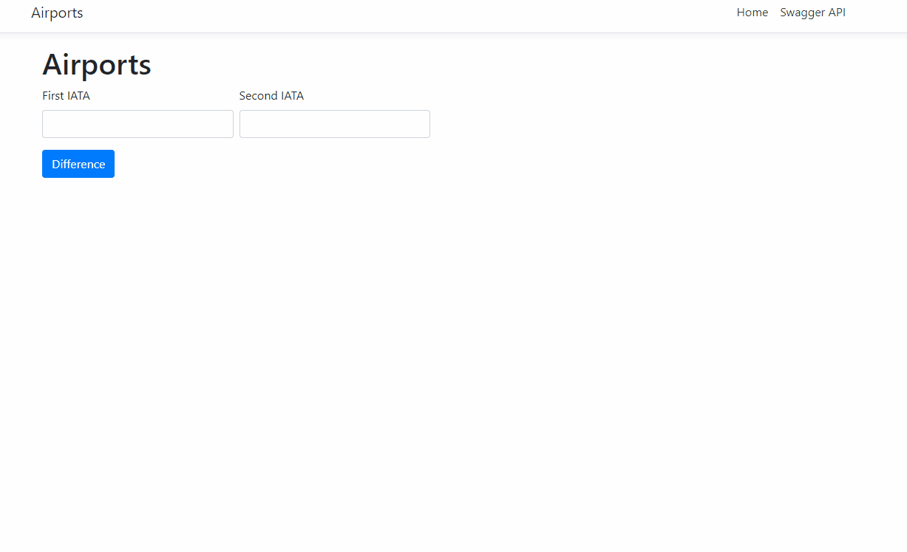

# Distance

This is an application to show a distance between two airports. User should type IATA code of the airports and then the app will show the distance measured in miles.

## How it works (gif)

You may click on the gif above to open it in a new tab with a high quality.

## How to start the app:

1. Execute `run.ps1` script
2. Wait for it
3. Open SPA via [http://localhost:4200](http://localhost:4200)

All you need to run the app will be containerized, so you will not have to install smth or run your IDEs.

## What inside:

- .net 5
- Angular 11
- Dockerfile
